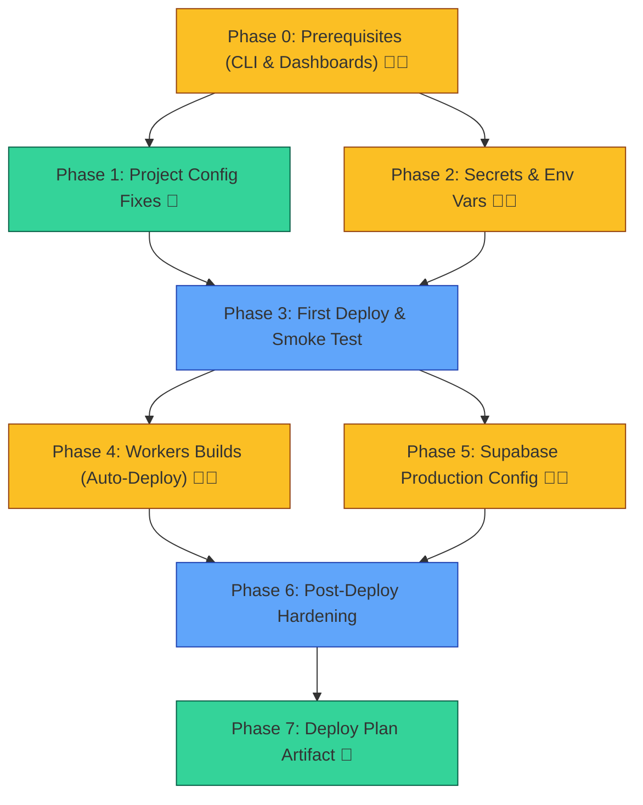

# Cloudflare Workers Deployment Plan — 10xCards

## Goal

Ship 10xCards to production on Cloudflare Workers with two deploy triggers: manual (`npm run deploy`) and automatic (push to `master` via Cloudflare Workers Builds). No GitHub Actions changes — auto-deploy is handled natively by Cloudflare's git integration.

## User Review Required

> [!IMPORTANT]
> **Workers vs. Pages command discrepancy**: Your [`infrastructure.md`](file:///home/awiacek/version-control/10xCards/context/foundation/infrastructure.md) references `wrangler pages deploy` and `wrangler pages secret put` commands, but your actual [`wrangler.jsonc`](file:///home/awiacek/version-control/10xCards/wrangler.jsonc) is configured as a **Workers** project (has `"main"` entrypoint field). This plan uses `wrangler deploy` and `wrangler secret put` — the Workers equivalents.

> [!WARNING]
> **Manual steps required**: Phase 0 and Phases 2, 4, and 5 require actions in the Cloudflare Dashboard or Supabase Dashboard that I cannot automate. I'll provide exact click-paths.

> [!IMPORTANT]
> **Supabase production instance**: This plan assumes you already have a hosted Supabase project. If you haven't set one up yet, that needs to happen first — you'll need the production `SUPABASE_URL` and `SUPABASE_KEY` values.

## Decisions Locked

| Decision | Choice |
|---|---|
| Deploy triggers | Manual (`npm run deploy`) **+** auto on push to `master` (Cloudflare Workers Builds) |
| CI/CD | Existing GHA CI (lint+build) **unchanged** — no deploy job in GHA |
| Auto-deploy mechanism | Cloudflare Workers Builds (native git integration, dashboard setup) |
| Environments | Production only |
| Project name | `10x-cards` |
| Custom domain | Not now — `10x-cards.vicksam.workers.dev` for MVP |
| Preview deploy access | Public is acceptable |

---

## Proposed Changes

### Phase 0 — Prerequisites ✅ COMPLETE

All prerequisites have been verified. Proceed directly to Phase 1.

<details>
<summary>All prerequisites verified — expand for details</summary>

| Prerequisite | Status | Detected |
|---|---|---|
| Node.js | ✅ | v24.14.0 |
| npm | ✅ | v11.9.0 |
| `node_modules` | ✅ | Present (dependencies installed) |
| Wrangler CLI | ✅ | v4.118.0 via `npx` (in `devDependencies`) |
| Wrangler auth | ✅ | OAuth Token — `vicksam@zoho.com` (Account ID: `10ac86d346d4d34e01b4aad30ce60eda`) |
| Supabase CLI | ✅ | v2.111.0 via `npx` (in `devDependencies`) |
| Supabase cloud project | ✅ | Production project configured |
| Git remote | ✅ | `origin → git@github.com:vicksam/10xCards.git` |
| Default branch | ✅ | `master` |
| GitHub Actions secrets | ✅ | `SUPABASE_URL` and `SUPABASE_KEY` configured |

> [!NOTE]
> Docker is **not running**, but that's only needed for local Supabase development (`npx supabase start`), not for production deployment.

</details>

---

### Phase 1 — Project Configuration Fixes

#### [MODIFY] [`wrangler.jsonc`](file:///home/awiacek/version-control/10xCards/wrangler.jsonc)

Rename the project from the scaffold default to the actual project name.

```diff
 {
   "$schema": "node_modules/wrangler/config-schema.json",
-  "name": "10x-astro-starter",
+  "name": "10x-cards",
   "main": "@astrojs/cloudflare/entrypoints/server",
   "compatibility_date": "2026-05-08",
   "compatibility_flags": ["nodejs_compat"],
   "assets": {
     "binding": "ASSETS",
     "directory": "./dist",
     "not_found_handling": "404-page",
   },
   "observability": {
     "enabled": true,
   },
 }
```

- [ ] **1.1** Rename `name` from `10x-astro-starter` → `10x-cards`

#### [NEW] `.dev.vars.example`

Template so contributors know what Cloudflare-local secrets are needed:

```env
# Cloudflare local dev secrets (used by wrangler dev / astro dev)
# Copy this file to .dev.vars and fill in your values.
# .dev.vars is gitignored — never commit it.

SUPABASE_URL=http://127.0.0.1:54321
SUPABASE_KEY=your-local-supabase-anon-key
```

- [ ] **1.2** Create `.dev.vars.example` file
- [ ] **1.3** Create your local `.dev.vars` with real values (copy from `.env` or Supabase dashboard)

#### [MODIFY] [`package.json`](file:///home/awiacek/version-control/10xCards/package.json)

Add deploy and rollback commands for the manual deploy workflow:

```diff
   "scripts": {
     "dev": "astro dev",
     "build": "astro build",
     "preview": "astro preview",
     "astro": "astro",
+    "deploy": "npm run build && wrangler deploy",
+    "deploy:rollback": "wrangler rollback",
     "lint": "eslint .",
     "lint:fix": "eslint . --fix",
     "format": "prettier --write ."
   },
```

- [ ] **1.4** Add `deploy` and `deploy:rollback` scripts to `package.json`

#### Edge Case Support
<details>
<summary>🔧 If <code>npm run build</code> fails with missing env vars</summary>

The Astro env schema marks `SUPABASE_URL` and `SUPABASE_KEY` as `optional: true`, so builds should succeed without them. If you still see errors, set them inline:
```bash
SUPABASE_URL=x SUPABASE_KEY=x npm run build
```
</details>

---

### Phase 2 — Secrets & Environment Variables

> **🧑‍💻 Manual — setting secrets on Cloudflare**

- [ ] **2.1** Set Supabase production secrets:
  ```bash
  # Each command will prompt you to paste the value
  npx wrangler secret put SUPABASE_URL
  npx wrangler secret put SUPABASE_KEY
  ```
- [ ] **2.2** Verify secrets are set:
  ```bash
  npx wrangler secret list
  # Should show SUPABASE_URL and SUPABASE_KEY (values hidden)
  ```

#### Edge Case Support

<details>
<summary>🔧 If <code>wrangler secret put</code> fails with "Worker not found"</summary>

The Worker doesn't exist yet on Cloudflare. Do your first deploy first:
```bash
npm run build && npx wrangler deploy
```
Then retry `wrangler secret put`. The first deploy creates the Worker; secrets attach to it afterward.

**Alternative**: Set secrets via the Cloudflare Dashboard: **Workers & Pages → 10x-cards → Settings → Variables and Secrets**.
</details>

<details>
<summary>🔧 If secrets work locally but fail in production</summary>

1. After setting a secret, **redeploy** (`npm run deploy`) — secrets don't hot-reload into running Workers.
2. Verify the access pattern: the code uses `astro:env/server` which is correct for Workers.
3. Run `npx wrangler tail` and trigger a request to check if env vars resolve to `null`.
</details>

---

### Phase 3 — First Manual Deploy & Smoke Test

- [ ] **3.1** Run the production build and deploy:
  ```bash
  npm run deploy
  # Which runs: npm run build && wrangler deploy
  ```
- [ ] **3.2** Note the deployment URL from wrangler output (e.g., `https://10x-cards.vicksam.workers.dev`)
- [ ] **3.3** Smoke test the deployed app:
  - [ ] Homepage loads (`/`)
  - [ ] Auth pages load (`/auth/signin`, `/auth/signup`)
  - [ ] Protected route redirects to signin (`/dashboard`)
  - [ ] Sign up flow works (email + password)
  - [ ] Sign in flow works
  - [ ] After sign in, `/dashboard` loads
  - [ ] Sign out works
- [ ] **3.4** Check Workers logs for errors:
  ```bash
  npx wrangler tail
  # Real-time log stream — Ctrl+C to exit
  ```

#### Edge Case Support

<details>
<summary>🔧 If deploy succeeds but site shows 500 errors</summary>

1. **Check logs**: `npx wrangler tail` — look for "ReferenceError" or "TypeError" indicating Node.js API incompatibility
2. **Check secrets**: `npx wrangler secret list` — ensure both appear
3. **Supabase client null**: The code returns `null` when env vars are missing (`optional: true`). Auth will silently fail — check browser console.
4. **V8 isolate issues**: Deps using `fs`, `child_process`, `net` crash at runtime. Current deps (Supabase, React, Tailwind) are safe.
</details>

<details>
<summary>🔧 If auth redirects fail (redirect URL mismatch)</summary>

Supabase rejects redirects to URLs not in its allow-list:
1. **Supabase Dashboard → Authentication → URL Configuration**
2. Add your Workers URL to **Site URL** or **Redirect URLs**: `https://10x-cards.vicksam.workers.dev`
3. Local `supabase/config.toml` `site_url` is local-only — doesn't affect production.
</details>

<details>
<summary>🔧 If cookie-based auth doesn't persist</summary>

1. **Cookie domain**: On `workers.dev` cookies should work. Cross-subdomain may not.
2. **Cookie size**: Workers cap at 4KB per `Set-Cookie` header. Supabase sessions fit but check `wrangler tail` for errors.
3. **Browser blocking**: Supabase SSR sets same-domain cookies so third-party blocking shouldn't apply.
</details>

<details>
<summary>🔧 If build output exceeds 10MB compressed limit</summary>

```bash
npm run build && du -sh dist/
```
If approaching limit: enable `serverMinify: true` in Astro config, use dynamic imports, review unused deps.
</details>

---

### Phase 4 — Cloudflare Workers Builds (Auto-Deploy on Push)

> **🧑‍💻 Manual — dashboard setup, cannot be automated via CLI/API**

This connects your GitHub repo to Cloudflare so every push to `master` triggers an automatic build and deploy — no GitHub Actions needed.

- [ ] **4.1** Go to **Cloudflare Dashboard → Workers & Pages → 10x-cards → Settings → Builds**
- [ ] **4.2** Click **Connect** and authorize the **Cloudflare GitHub App** on your repository (`10xCards`)
- [ ] **4.3** Configure build settings:
  - **Production branch**: `master`
  - **Build command**: `npm run build`
  - **Deploy command**: `npx wrangler deploy` (should be auto-detected)
- [ ] **4.4** Add build-time environment variables in the Builds settings:
  - `SUPABASE_URL` = your production Supabase URL
  - `SUPABASE_KEY` = your production Supabase anon key
  > These are needed for `astro build` during the Cloudflare build, separate from the runtime secrets set in Phase 2.
- [ ] **4.5** Trigger a test deploy by pushing a commit to `master`
- [ ] **4.6** Verify in the Cloudflare Dashboard that the build completes and deploys successfully
- [ ] **4.7** Verify the GitHub commit / PR shows Cloudflare build status checks

#### How it works alongside GHA

```
Push to master
├── GitHub Actions CI (existing) → lint + build → ✅/❌ status check
└── Cloudflare Workers Builds   → build + deploy → ✅/❌ status check + live URL
```

Both run independently. GHA validates code quality; Cloudflare handles deployment. If the GHA CI fails, the Cloudflare build still runs (and vice versa). To enforce "deploy only if CI passes," you'd need branch protection rules requiring the GHA check — this is optional and can be added later.

#### Edge Case Support

<details>
<summary>🔧 If the Cloudflare build fails with missing env vars</summary>

Build-time env vars (for `astro build`) are separate from runtime secrets (for the Worker):
- **Build-time**: Set in **Builds → Environment variables** in the Cloudflare Dashboard (Step 4.4)
- **Runtime**: Set via `wrangler secret put` (Phase 2)

Both `SUPABASE_URL` and `SUPABASE_KEY` are needed in **both places**: build-time for Astro's env schema validation, and runtime for the Supabase client.
</details>

<details>
<summary>🔧 If Worker name mismatch causes "Worker not found" in auto-deploy</summary>

The Worker name in `wrangler.jsonc` (`"name": "10x-cards"`) must match the Worker listed in the Cloudflare Dashboard. If you created the Worker manually with a different name, either:
1. Rename it in the dashboard, or
2. Update `wrangler.jsonc` to match the dashboard name
</details>

<details>
<summary>🔧 If you want to disable auto-deploy temporarily</summary>

Go to **Workers & Pages → 10x-cards → Settings → Builds** and toggle off automatic deployments. Manual deploys via `npm run deploy` remain unaffected.
</details>

<details>
<summary>🔧 If GHA CI and Cloudflare deploy show conflicting results</summary>

They are independent pipelines. Common scenario: GHA CI fails (lint error) but Cloudflare deploys successfully (it doesn't run lint). To prevent this, add a GitHub branch protection rule on `master` requiring the GHA CI check to pass before merge. This way, Cloudflare only builds code that already passed CI.
</details>

---

### Phase 5 — Supabase Production Configuration

> **🧑‍💻 Partially manual — dashboard actions required**

- [ ] **5.1** Verify Supabase project exists and is on the Free tier (or appropriate plan)
- [ ] **5.2** Configure redirect URLs in Supabase Dashboard:
  - **Authentication → URL Configuration → Site URL**: Set to your production URL (`https://10x-cards.vicksam.workers.dev`)
  - **Redirect URLs**: Add your production URL
- [ ] **5.3** Verify email confirmations setting: your local `config.toml` has `enable_confirmations = false` — check if your production Supabase project matches (Authentication → Settings → Email)
- [ ] **5.4** Test the full auth flow on the production URL:
  - Sign up with a real email
  - Verify the confirmation email behavior matches expectations
  - Sign in
  - Verify session persists across page refreshes

#### Edge Case Support

<details>
<summary>🔧 If Supabase returns "Invalid API key" in production</summary>

1. Verify you're using the **anon (public)** key, not the **service_role** key
2. Check: **Supabase Dashboard → Project Settings → API → Project API keys → anon public**
</details>

<details>
<summary>🔧 If auth works locally but fails in production</summary>

1. **URL mismatch**: Supabase redirect allow-list must include your production URL exactly (with `https://`, no trailing slash)
2. **Cookie handling**: `@supabase/ssr` sets auth cookies — ensure your domain isn't triggering cross-origin restrictions
3. **CORS**: Supabase allows all origins by default. If customized, add your Workers URL.
</details>

---

### Phase 6 — Post-Deploy Hardening

- [ ] **6.1** Verify observability is working:
  ```bash
  npx wrangler tail              # Real-time logs
  npx wrangler deployments list  # Deployment history
  ```

- [ ] **6.2** Test rollback capability:
  ```bash
  npx wrangler deployments list      # Find a previous deployment ID
  npm run deploy:rollback             # Rollback to previous version
  ```

- [ ] **6.3** Verify bundle size is within limits:
  ```bash
  npm run build && du -sh dist/
  ```

---

### Phase 7 — Deploy Plan Artifact

Write the deployment record to `context/deployment/deploy-plan.md`:

#### [NEW] `context/deployment/deploy-plan.md`

```markdown
---
project: 10x-cards
deployed_at: <date-of-first-production-deploy>
platform: Cloudflare Workers
production_url: https://10x-cards.vicksam.workers.dev
---

## Deployment Summary

- **Platform**: Cloudflare Workers (with Static Assets)
- **Adapter**: @astrojs/cloudflare v13.5
- **CLI**: wrangler v4.90
- **Deploy triggers**:
  - Manual: `npm run deploy` (runs `npm run build && wrangler deploy`)
  - Automatic: Push to `master` → Cloudflare Workers Builds
- **Rollback**: `npm run deploy:rollback` or `npx wrangler rollback <id>`
- **CI**: GitHub Actions on PR / push to `master` → lint + build (no deploy)

## Environments

| Environment | URL | Deploy trigger |
|---|---|---|
| Production | `https://10x-cards.vicksam.workers.dev` | Manual + auto on push to `master` |

## Secrets Wired

| Secret | Location | Purpose |
|---|---|---|
| SUPABASE_URL | Cloudflare Workers secrets (runtime) | Supabase API endpoint |
| SUPABASE_KEY | Cloudflare Workers secrets (runtime) | Supabase anon key |
| SUPABASE_URL | Cloudflare Workers Builds (build-time) | Astro build env var |
| SUPABASE_KEY | Cloudflare Workers Builds (build-time) | Astro build env var |
| SUPABASE_URL | GitHub Actions secret | GHA CI build env var |
| SUPABASE_KEY | GitHub Actions secret | GHA CI build env var |

## Operational Runbook

- **Deploy**: `npm run deploy` or push to `master`
- **Rollback**: `npm run deploy:rollback` or `npx wrangler rollback <id>`
- **Logs**: `npx wrangler tail`
- **Deployments**: `npx wrangler deployments list`
- **Secrets**: `npx wrangler secret list` / `npx wrangler secret put <KEY>`
```

- [ ] **7.1** Create `context/deployment/deploy-plan.md` after first successful deploy (fill in actual URL and date)

---

## Execution Order & Dependencies



**Legend**: 🟡 Yellow = requires manual user action | 🟢 Green = agent-automatable | 🔵 Blue = mixed

---

## Verification Plan

### Automated Tests

```bash
# Lint passes
npm run lint

# Build succeeds
SUPABASE_URL=x SUPABASE_KEY=x npm run build

# Bundle size check (must be < 10MB compressed)
du -sh dist/
```

### Manual Verification

After the first deploy, verify:

| Check | How | Expected |
|---|---|---|
| Homepage loads | Visit `/` | 200 OK, renders content |
| Auth pages load | Visit `/auth/signin` | 200 OK, form visible |
| Protected redirect | Visit `/dashboard` unauthenticated | 302 → `/auth/signin` |
| Sign up works | Complete signup form | Account created, redirect |
| Sign in works | Sign in with new account | Session set, redirect to dashboard |
| Dashboard loads | Visit `/dashboard` authenticated | 200 OK, user content |
| Sign out works | Trigger signout | Session cleared, redirect |
| Logs stream | `npx wrangler tail` | Request logs visible |
| Rollback works | `npm run deploy:rollback` | Previous version live |
| Auto-deploy | Push commit to `master` | Cloudflare build triggers, new version live |

---

## Files Changed Summary

| File | Action | Phase |
|---|---|---|
| [`wrangler.jsonc`](file:///home/awiacek/version-control/10xCards/wrangler.jsonc) | MODIFY — rename project to `10x-cards` | 1 |
| `.dev.vars.example` | NEW — local dev secrets template | 1 |
| [`package.json`](file:///home/awiacek/version-control/10xCards/package.json) | MODIFY — add `deploy` and `deploy:rollback` scripts | 1 |
| `context/deployment/deploy-plan.md` | NEW — deployment record (after first deploy) | 7 |
